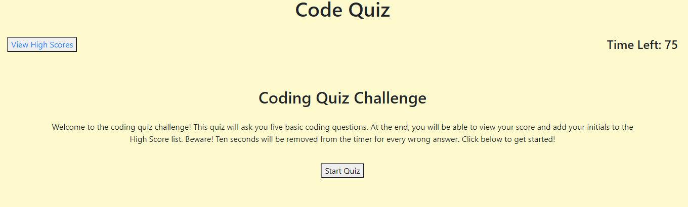
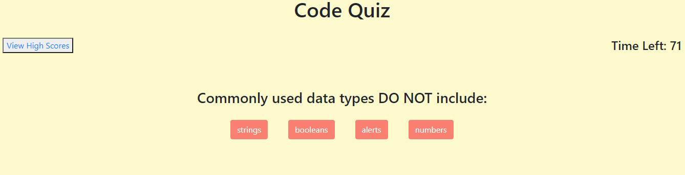
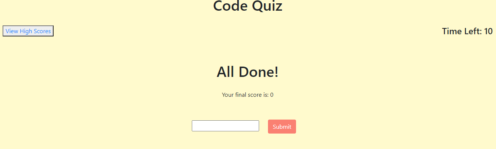
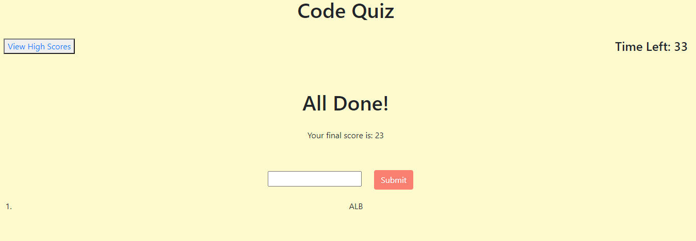

## Code Quiz Homework

Alyson Bennett

## Code Quiz Homework Objectives

The goal of this homework assignment was to create a timed quiz with basic questions about JavaScript. When the user clicks the "Start Quiz" button, they are immediately shown the first question with four multiple choice answers.

If the user chooses the correct answer, there is a feedback comment with "Correct!" and they are moved on to the next question.

If the user chooses the wrong answer, there is a feedback comment with "Wrong", 10 seconds is removed from the running time, and they are moved onto the next question. 

Once the user has completed the quiz, the user is shown their score and asked to input their initials to print their score to the high scores list. They are then able to go back and retake the quiz or clear the high scores. 

## Process

To begin this assignment, I pseudo-coded each step of the code. This started with white boarding how each section of the quiz should look (landing page, quiz questions, all done, high scores). I then set up the HTML, JavaScript, and CSS files that I felt were needed. From there, I declared global variables and pseudo-coded the steps to complete functions to make the quiz work as intended.

## Screen Shots of Code Quiz

This screen shot shows what the user will see when they first open the website.

This screen shot shows how the questions and choices are displayed after the user presses the "Start Quiz" button.

This screen shot displays what is shown when the quiz is over. 

This screen shot shows what the user sees when they submit their initials to save their high score.

## Final Thoughts and Issues

This homework assignment was much harder than any I had done before, and way more difficult than I had anticipated. I received help from my tutor, TA's, and fellow students in study groups. On top of that, there were hours of googling, trial and error, undoing, pulling previous working GitHub files, and contemplation.

I'm still having issues with storing the scores and initials to the high scores, as well as displaying the feedback comments. I'm still working to figure out these problems, but I feel that I have learned a lot with this assignment.

Thank you. 
